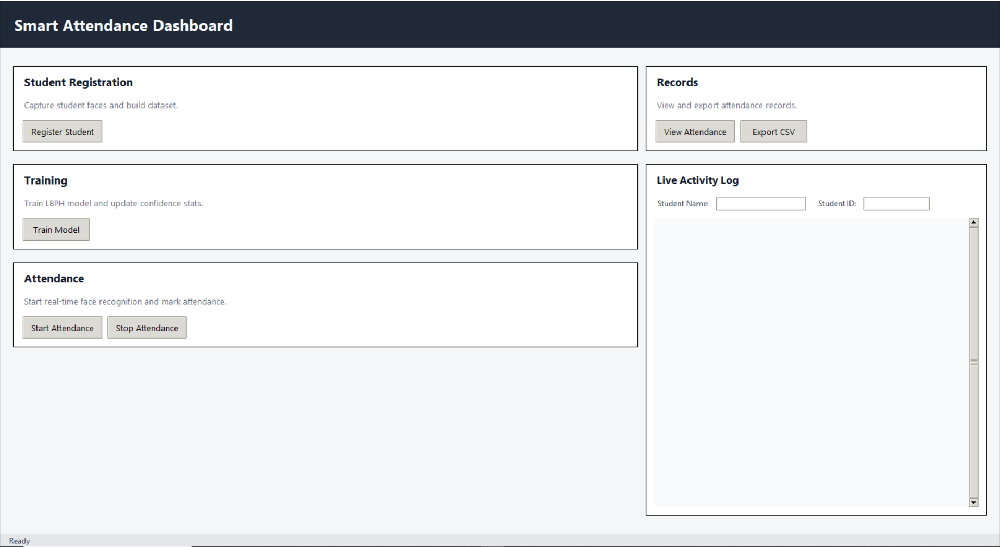

# Smart Attendance System

Smart Attendance is a face recognition based attendance solution built with OpenCV LBPH, MediaPipe, and SQLite. It provides both a CLI workflow and a Tkinter GUI for registering students, training a model, and marking attendance in real time.

## What this is
This project captures face samples for each student, trains an LBPH model, and performs live recognition to mark attendance. It stores records in a local SQLite database and supports exporting attendance to CSV.

## How it works
1. Registration: capture face images for each student in dataset/{name_id}/.
2. Training: train an LBPH model and compute calibrated confidence thresholds.
3. Recognition: run live webcam inference and mark attendance in the database.
4. Storage: SQLite tables store students, attendance, and unknown detections.

## Features
- MediaPipe face detection for stable registration and validation.
- LBPH model training with dynamic threshold calibration.
- Real-time recognition with confidence smoothing.
- Attendance database with duplicate protection (one per student per day).
- CSV export and GUI dashboard.

## Requirements
- Python 3.11+
- A working webcam
- Packages listed in requirements.txt

## Installation (Windows)
```powershell
python -m venv .venv
.
.\.venv\Scripts\python.exe -m pip install -r requirements.txt
```

## Usage

### GUI Dashboard
```powershell
.\run_gui.bat
```

### CLI Menu
```powershell
.\.venv\Scripts\python.exe .\main.py
```

### Direct GUI Launch (without batch file)
```powershell
.\.venv\Scripts\python.exe .\gui\attendance_app.py
```

## Dataset Guidelines
- Capture at least 50 images per student with varied angles and lighting.
- Avoid blurry or heavily occluded faces.
- Use consistent naming: dataset/FullName_ID/

## Database
- Database file: database/attendance.db
- Tables: students, attendance, unknown_faces
- If you change schemas, delete database/attendance.db and re-run.

## Project Structure (high level)
- data/face_data_collector.py: registration pipeline
- models/face_trainer.py: training and calibration
- models/face_recognizer.py: recognition and attendance
- database/attendance_db.py: SQLite storage
- gui/attendance_app.py: Tkinter dashboard

## Screenshot
